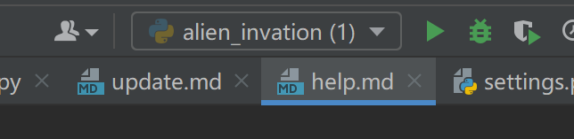
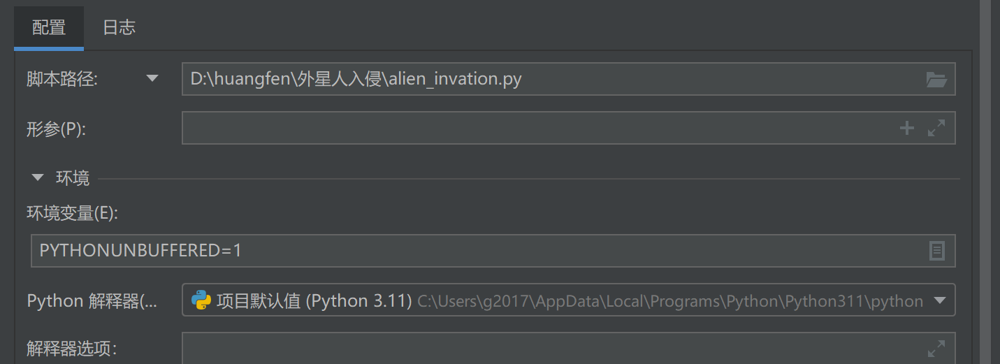

一般拿到别人的代码都是不能直接在自己电脑上跑起来，这是因为自己python解释器的位置和别人的电脑不一样
所以需要重新配置一下python解释器的位置
1. 打开pycharm，点击file->settings->project:xxx->project interpreter
2. 点击右上角的齿轮，选择add
3. 选择system interpreter，点击右边的三个点，找到自己的python解释器的位置，点击ok
4. 点击ok，等待安装完成 

（上面4点是ai自己生成的，我说说我是怎么解决的）
点击pycharm右上角的东西，那个倒三角“▼”

选择编辑配置
脚本路径和python解释器改成自己本地的位置就好了

运行alien_invasion.py就可以了,这是主方法。其他py文件的解释器位置也要改一下，不然会报错